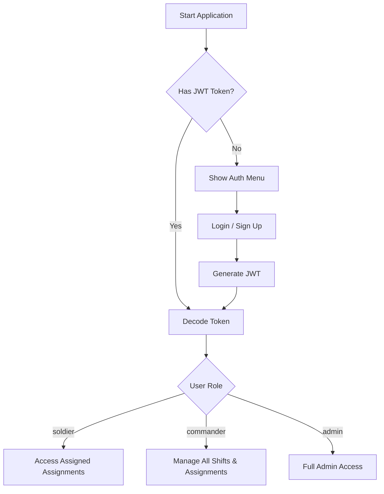

# GuardBase 🪖

A military base shift management system built with NestJS, featuring role-based access control for Soldiers, Commanders, and Admins.

## 🛠️ Features

- User registration and login with JWT authentication
- Role-based access: `soldier`, `commander`, `admin`
- Full CRUD for:
  - Users
  - Shifts
  - Assignments
- Authorization via custom `RolesGuard`
- Protected endpoints based on user roles

## 🗂️ Role Permissions Overview

| Role       | Users         | Shifts       | Assignments       |
|------------|---------------|--------------|-------------------|
| **Soldier**  | Register & login only | View assigned only | View assigned only |
| **Commander** | Full CRUD (except admin deletion) | Full CRUD | Assign & view |
| **Admin**     | Full control | Full control | Full control |

## 🔄 Application Flowchart



## ▶️ Getting Started

```bash
npm install
npm run start:dev
```

## 🔐 Example: Making Authenticated Request

```bash
TOKEN=$(curl -s -X POST http://localhost:3000/auth/login \
  -H "Content-Type: application/json" \
  -d '{"email": "commander1@example.com", "password": "passCmd123"}' | jq -r '.token')

curl -X GET http://localhost:3000/shifts \
  -H "Authorization: Bearer $TOKEN"
```

---

### 📁 Project Structure

- `auth/` – Auth module with login, signup, JWT, and guards
- `users/` – User management module
- `shifts/` – Shift management module
- `assignments/` – Assignment allocation module